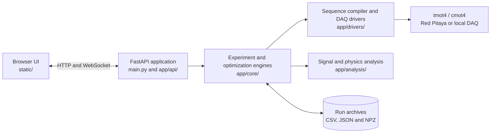

# MIGA Controller

MIGA Controller is a browser-based control, data-acquisition and analysis application for cold-atom experiments. It combines sequence generation, hardware triggering, live waveform analysis, marker-based scans, Bayesian optimization, synchronized acquisition and archive re-analysis.

The backend is built with Python and FastAPI. The browser interface uses Vue 3 and Plotly.js.

## Installation

### Requirements

- Linux with Bash
- Python 3 with `venv` support
- Git
- Network access during the first dependency installation
- `tmot4` and `cmot4` for real sequence compilation

On Debian or Ubuntu, install the basic system packages with:

```bash
sudo apt-get update
sudo apt-get install -y git python3 python3-venv
```

Clone the project and select the current development branch:

```bash
git clone --branch marker-optimization https://github.com/Quantum00man/MIGA-controller.git
cd MIGA-controller
```

### Recommended setup

Run the project launcher:

```bash
./launch_code
```

On a graphical desktop this opens the launcher window. Select **Check / Repair Env** to create `.venv/`, install `requirements.txt` and validate the Ax runtime, then select **Start Controller**. On a headless machine the same command prepares the environment and starts the server in the foreground.

If the scripts are not executable after copying the repository, run:

```bash
chmod +x launch_code start_controller.sh
```

### Manual setup

The same environment can be prepared manually:

```bash
python3 -m venv .venv
.venv/bin/python -m pip install --upgrade pip
.venv/bin/python -m pip install --index-url https://download.pytorch.org/whl/cpu torch
.venv/bin/python -m pip install -r requirements.txt
```

## Starting the controller

On a graphical desktop, open the launcher and select **Start Controller**:

```bash
./launch_code
```

On a terminal or headless machine, start it directly in the foreground:

```bash
./start_controller.sh
```

Then open:

- Control console: <http://127.0.0.1:8000/>
- Marker optimization: <http://127.0.0.1:8000/marker-optimize.html>
- Bayesian optimization: <http://127.0.0.1:8000/optimize.html>
- Data archive: <http://127.0.0.1:8000/archive.html>
- Settings: <http://127.0.0.1:8000/settings.html>

Useful terminal commands:

```bash
./start_controller.sh --check-only       # validate or repair the environment
./start_controller.sh --start-detached   # start in the background
./start_controller.sh --status           # show server state and log path
./start_controller.sh --stop             # stop the background server
```

The default listener is `0.0.0.0:8000`. It can be changed with environment variables:

```bash
MIGA_HOST=127.0.0.1 MIGA_PORT=8080 MIGA_RELOAD=0 ./start_controller.sh
```

For the first real experiment, open the Settings page and configure the `tmot4`/`cmot4` paths, DAQ platform and address, timing channels and analysis constants. Simulation mode can be used when compatible mock hardware is available.

## Software architecture



The application is divided into five main layers:

- `main.py` starts FastAPI, registers the API and WebSocket endpoint, and serves the browser interface.
- `static/` contains the control, marker optimization, Bayesian optimization, archive and settings pages.
- `app/api/` and `app/models/` define HTTP endpoints and validated request/response models.
- `app/core/` coordinates scans, marker workflows, Bayesian optimization, synchronization, pulse generation and data persistence.
- `app/drivers/` communicates with compilers and acquisition hardware, while `app/analysis/` performs fitting, atom-number calculations, lock-in analysis and phase-space processing.

At runtime, the browser submits an experiment request to the API. The core engine renders and compiles the sequence, triggers the selected acquisition device, processes the returned waveforms, streams results to the browser and stores the run for later re-analysis.

## Tests and documentation

Run the regression tests with:

```bash
.venv/bin/python -m unittest discover -s tests -v
```

The complete operation, optimization, formula and troubleshooting reference is available in [the technical manual](docs/manual/manual.tex). A compiled copy is provided at [output/pdf/manual.pdf](output/pdf/manual.pdf).

## Author

Yiming MENG — MIGA / Cold Atoms Bordeaux, Université de Bordeaux.
