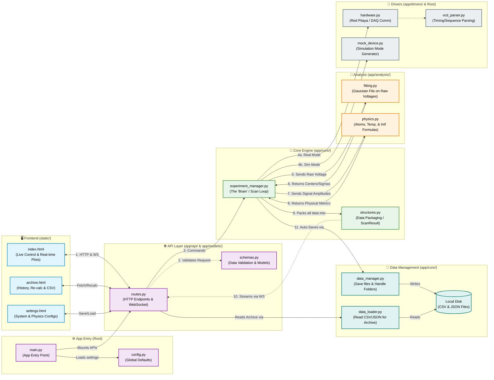

# ⚛️ MIGA Controller - Cold Atom Experiment DAQ & Analysis System

**MIGA Controller** is a high-performance, web-based control and data acquisition (DAQ) system designed for cold atom experiments (e.g., Magneto-Optical Traps, Atom Interferometry). 

Built with **Python (FastAPI)** on the backend and **Vue.js 3 + Plotly.js** on the frontend, it provides a seamless experience for sequence generation, hardware triggering, real-time oscilloscope visualization, on-the-fly Gaussian fitting, and historical data re-analysis.

---

## ✨ Key Features

* **Dynamic Sequence Generation**: Upload `.mot` templates and dynamically inject parameters using 1D/2D scans, specific arrays, or **Custom Python Formulas** (e.g., `318000 - np.sqrt(P0)`).
* **Real-time Acquisition & Fitting**: Interfaces with Red Pitaya (STEMlab) or local DAQ servers. Automatically performs Gaussian fitting on Time-of-Flight (TOF) signals to calculate Atom Number, Temperature, and Transition Probabilities.
* **Smart VCD Parsing**: Automatically parses `.vcd` files compiled by `cmot` to calculate the exact physical delay ($\Delta t$) between sequence "Launch" and hardware "Trigger".
* **Signal Filters**: Built-in noise and saturation rejection (`Max Limit` and `Min Threshold`) ensures clean data output.
* **Data Archive & Re-Analysis**: A dedicated Archive interface to browse historical runs hierarchically (Year/Month/Day/Run). Modify calibration parameters post-experiment and instantly recalculate results.

---

## 🚀 Quick Start & SSH Clone

To securely clone this repository using SSH, open your terminal and run:

```bash
git clone [https://github.com/Quantum00man/MIGA-controller.git](https://github.com/Quantum00man/MIGA-controller.git)
cd MIGA-controller
```


Launch the GUI launcher:
```bash
./launch_code
```

If no graphical desktop is available, `launch_code` falls back to the terminal launcher.

The GUI launcher can:
```text
1. Create `.venv/` if it does not exist.
2. Check and repair the packages listed in `requirements.txt`.
3. Validate the Ax runtime import path before starting the backend.
4. Start or stop the controller while keeping the original `0.0.0.0:8000 --reload` behavior.
5. Show tmot / cmot path status and the live server log.
```

Terminal fallback remains available:
```bash
./start_controller.sh
./start_controller.sh --check-only
./start_controller.sh --status
./start_controller.sh --start-detached
./start_controller.sh --stop
```

---

## ⚙️ First-Time Setup Guide

Before running your first experiment, configure the system via the Web UI (`http://127.0.0.1:8000/settings.html`).

### 1. System Paths (Compilers)
The system requires paths to your sequence compilers (`tmot4` / `cmot4`).
* Go to the **System Paths** tab.
* In the "Quick Configuration" box, enter the path to your `mot4ztex` folder (e.g., `C:\mot4ztex` or `/home/user/mot4ztex`).
* Click **Auto-Fill Paths** to automatically link the binaries and the default template.

### 2. Network & Hardware
* Go to the **Network** tab.
* Select your **Hardware Platform** (Red Pitaya or Local DAQ Server).
* Set the **Network Timeout** to a safe margin (e.g., `5` seconds) to prevent premature disconnections during sequences.

### 3. Physics & Gains (Calibration)
* Go to the **Physics & Gains** tab.
* Set your **Signal Validation Filters**:
   * **Max Limit (V)**: e.g., `9.5` (Discards points that saturate the DAQ or cause errors).
   * **Min Threshold (V)**: e.g., `0.0001` (Discards points that are purely background noise).
* Fill in your physical calibration constants: `Alpha`, `Beta`, `Ratio (R)`, and `Coeff (K)`.

---

## 🏗️ System Architecture & Data Flow

To help new developers and users understand how the files interact, here is a visual map of the system's architecture.



### 📖 The Component Guide (For Beginners)

If you need to modify the code, here is what each file does:

**1. The Frontend (`static/`)**
* **`index.html`**: The control dashboard. It takes user inputs (scan parameters), sends them to the server, and plots the real-time data streaming back via WebSockets.
* **`archive.html`**: The history browser. It loads past experimental data from the disk and allows users to tweak physics parameters to *recalculate* the results instantly.
* **`settings.html`**: The configuration panel.

**2. The API Layer (`app/api/` & `app/models/`)**
* **`routes.py`**: The traffic controller. It receives HTTP requests and WebSocket connections from the Frontend and routes them to the right backend functions.
* **`schemas.py`**: The strict "Customs Guard". Built with Pydantic, it ensures every piece of data going in or coming out of the API matches exactly what is expected. *If a variable isn't listed here, it won't be sent to the frontend!*

**3. The Core Engine (`app/core/`)**
* **`experiment_manager.py`**: The "Brain" of the application. When you click start, this script runs the main loop. It talks to the hardware, hands data to the math modules, and streams the results back.
* **`structures.py`**: The packaging boxes. It defines `dataclass` objects (like `ScanResult`) that hold all the physical metrics for a single scan point.

**4. Analysis & Math (`app/analysis/`)**
* **`fitting.py`**: Handles mathematical curve fitting (e.g., Gaussian fits) on the raw voltage arrays.
* **`physics.py`**: The pure physics module. It converts voltages to Atom Numbers, calculates Temperatures, and executes the Interferometer formulas (the $N1, N2$ equations).

**5. Hardware Drivers (`app/drivers/` & Root)**
* **`hardware.py`**: Communicates directly with the physical instruments (Red Pitaya / DAQ).
* **`mock_device.py`**: A simulator that generates fake noise and Gaussian signals so we can test the UI without turning on the lasers.

**6. Data Storage (`app/core/`)**
* **`data_manager.py` & `data_loader.py`**: These handle writing the final data to CSV/JSON files on your hard drive, and reading them back when someone opens `archive.html`.

---

## 🧠 Core Modules Architecture

* **Control Console (`index.html`)**: The main dashboard. Upload templates, set sweep parameters, write mathematical Link formulas, and monitor real-time oscilloscope traces and analysis fits.
* **Experiment Manager (`experiment_manager.py`)**: The system core. It runs a dual-thread pipeline: the Producer compiles and triggers hardware, while the Consumer filters data, applies offset corrections, runs ODR fitting, and saves the data.
* **Hardware Driver (`hardware.py`)**: Handles TCP/HTTP communications with the DAQ. Features a robust retry mechanism to ensure no data is lost during disk-write micro-delays.
* **Data Archive (`archive.html`)**: Allows loading old `results.csv` and `step_xxxx.npz` files. Allows on-the-fly modification of analysis parameters and exporting the recalculations to CSV without altering raw data.

---

## 📐 Physical Quantities & Calculations

The system calculates key cold atom metrics from the voltage signals of the UP ($F=2$) and DOWN ($F=1$) detectors. 

### 1. Gaussian Area
The raw signal area is derived from the Gaussian fit:
$$\text{Area} = A \times |\sigma| \times \sqrt{2\pi}$$
Where $A$ is the fitted Amplitude and $\sigma$ is the standard deviation (width in seconds).

### 2. Atom Number ($N_{F2}$ and $N_{F1}$)
To account for detection crosstalk between the two states, the system decouples the signals using a linear system:
$$N_{F2} = (\text{Area}_{UP} - \text{Area}_{DW} \times \alpha) \times K$$
$$N_{F1} = (\text{Area}_{DW} - \text{Area}_{UP} \times \beta) \times R \times K$$
* **$\alpha$ (Alpha) / $\beta$ (Beta)**: Crosstalk correction coefficients.
* **$R$ (Ratio)**: Sensitivity ratio between DOWN and UP channels.
* **$K$ (Coeff)**: Overall conversion coefficient from Voltage $\times$ Time to Atom Number.

### 3. Transition Probability
The percentage of atoms in each hyperfine state:
$$P_{F2} = \frac{N_{F2}}{N_{F1} + N_{F2}} \times 100\%$$
$$P_{F1} = \frac{N_{F1}}{N_{F1} + N_{F2}} \times 100\%$$
*(Calculated only when total atoms \neq 0)*.

### 4. Time-of-Flight Temperature (TOF)
Temperature is calculated from the expansion width ($\sigma$) and the ballistic flight time ($t_{flight}$):
$$T = \frac{M}{k_B} \left( \frac{v_{launch}}{t_{flight}} - g \right)^2 \sigma^2 \times 10^6 \quad (\mu\text{K})$$
Where:
* $M = 1.443 \times 10^{-25}$ kg (Mass of Rb87).
* $k_B = 1.38 \times 10^{-23}$ J/K (Boltzmann constant).
* $g = 9.81$ m/s$^2$ (Gravity acceleration).
* $v_{launch}$: Initial launch velocity (m/s) configured in settings.

---

## 🗂 Data Storage Structure
Experiment data is organized hierarchically in your `DATA_BASE_DIR`:
```text
data/
└── 2026/
    └── 02/
        └── 15/
            └── run01_20260215/
                ├── config.json         # Scan parameters & settings snapshot
                ├── results.csv         # Decimated results for quick loading
                ├── sequence.mot        # A copy of the exact sequence used
                └── waveforms/          
                    ├── step_0000.npz   # Compressed raw array (Trace + Fit)
                    └── step_0001.npz   
```
---

## 👥 Author & Acknowledgments

* **[Yiming MENG]** - *Lead Developer / Physicist* - [GitHub](https://github.com/Quantum00man)

Developed and maintained for the **MIGA Experiment** at **[MIGA/Cold atom in Bordeaux/Université de Bordeaux]**(https://www.coldatomsbordeaux.org/miga). 
