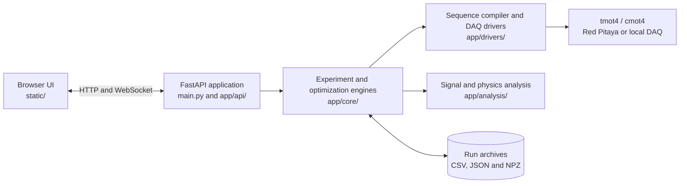

# MIGA Controller

MIGA Controller is a browser-based control, data-acquisition and analysis application for cold-atom experiments. It combines sequence generation, hardware triggering, live waveform analysis, marker-based scans, Bayesian optimization, synchronized acquisition and archive re-analysis.

The main-page planner can be used during an active Live or SYNC run. It snapshots future Master and Slave sequences without touching the active template, supports mixed regular/SYNC queues, can start automatically after the current run, and delays overdue fixed-time tasks until hardware is free. Stops and execution errors preserve and pause the queue for an explicit continue, retry or skip decision.

Transfer Function scans can optionally read a Thorlabs PM100A from the authenticated Hardware-controller after every normal shot. The first successful reading is the power baseline. A non-zero relative-change threshold pauses between shots, invalidates the complete 0°/90° frequency attempt, runs the prepared Bragg Fringes Calibration as a separately archived recovery run, applies its generated target-fringe MOT, resets the baseline and rescans that frequency. The recovery MOT and complete calibration parameter set can be loaded directly from a previous Bragg Fringes Calibration archive run or supplied manually. Zero-phase baseline shots are never sampled. All non-scheduled scans also support manual shot-boundary Pause/Resume.

Transfer Function, Bragg Fringes Calibration and eligible Standard scans can also run a user-supplied periodic interferometer-labeling MOT. Standard support covers 1D non-randomized Live and Scheduled scans using Classic Placeholders or Auto Markers, plus Classic SYNC scans (including Independent P0). Standard scans calibrate before the first science shot, check the configured minute interval after each completed science shot, and do not add an endpoint block. The MOT is stored locally in Settings on each controller and is never copied through SYNC, so Master and every Slave execute their own file. Each block derives $I_\alpha$ from fitted `Prob_UP_F2`, archives its uncertainty and validity, and updates the live monitor. Final analysis uses piecewise-linear time interpolation of accepted calibration points independently on every node.

Phase Noise Analyze runs selected fringe-derived $T^2$ values as an ordered batch of independent Scan numbers. Every Scan starts with a local $I_\alpha$ calibration and can repeat calibration by elapsed time; calibration shots are excluded from the 1--N science-shot sequence and Allan statistics. In SYNC, the Master selects $T^2$, each Slave evaluates its own local fringe curve at that reference, and the Master distributes optional PM100A readings. New single-$T$ archives provide phase/power/$I_\alpha$ timelines, Allan analysis, differential A/C optimization and CSV/LabPlot export; legacy multi-$T$ archives remain readable with their original overview.

The backend is built with Python and FastAPI. The browser interface uses Vue 3 and Plotly.js.

## Installation

### Requirements

- Linux with Bash
- Python 3 with `venv` support
- Git
- Network access during the first dependency installation
- `tmot4` and `cmot4` for real sequence compilation

On Debian or Ubuntu, install the basic system packages with:

```bash
sudo apt-get update
sudo apt-get install -y git python3 python3-venv
```

Clone the project and select the current development branch:

```bash
git clone --branch marker-optimization https://github.com/Quantum00man/MIGA-controller.git
cd MIGA-controller
```

### Recommended setup

Run the project launcher:

```bash
./launch_code
```

On a graphical desktop this opens the launcher window. Select **Check / Repair Env** to create `.venv/`, install `requirements.txt` and validate the Ax runtime, then select **Start Controller**. On a headless machine the same command prepares the environment and starts the server in the foreground.

If the scripts are not executable after copying the repository, run:

```bash
chmod +x launch_code start_controller.sh
```

### Manual setup

The same environment can be prepared manually:

```bash
python3 -m venv .venv
.venv/bin/python -m pip install --upgrade pip
.venv/bin/python -m pip install --index-url https://download.pytorch.org/whl/cpu torch
.venv/bin/python -m pip install -r requirements.txt
```

## Starting the controller

On a graphical desktop, open the launcher and select **Start Controller**:

```bash
./launch_code
```

On a terminal or headless machine, start it directly in the foreground:

```bash
./start_controller.sh
```

Then open:

- Control console: <http://127.0.0.1:8000/>
- Marker optimization: <http://127.0.0.1:8000/marker-optimize.html>
- Bayesian optimization: <http://127.0.0.1:8000/optimize.html>
- Data archive: <http://127.0.0.1:8000/archive.html>
- Settings: <http://127.0.0.1:8000/settings.html>

Useful terminal commands:

```bash
./start_controller.sh --check-only       # validate or repair the environment
./start_controller.sh --start-detached   # start in the background
./start_controller.sh --status           # show server state and log path
./start_controller.sh --stop             # stop the background server
```

### Archive Server preview

The hardware-free Archive Server entry point can be started independently:

```bash
./archive_server check
MIGA_ARCHIVE_HOST=127.0.0.1 MIGA_ARCHIVE_PORT=8000 ./archive_server start
```

Open <http://127.0.0.1:8000/setup> to inspect and initialize an existing NAS mount, then
register Master and Slave source hosts. AFP/GVFS paths are accepted for interactive testing
but reported as non-persistent; use an OS-managed NFS or SMB mount for unattended service.

The controller's Data Archive page also provides a read-only Storage Audit. Audit reports
are saved as JSON and HTML under `Data_log/audit_reports/`; run directories are never
modified by the scan.

Archive Server dependencies and updates:

```bash
git pull --ff-only
sudo apt install rsync
.venv/bin/python -m pip install -r requirements-archive.txt
MIGA_ARCHIVE_HOST=0.0.0.0 MIGA_ARCHIVE_PORT=8765 ./archive_server start
```

Open `http://SERVER-IP:8765/` for the Dashboard hub: NAS mount/identity status,
device connection checks, last attempted and successful pulls, publication jobs,
Collections snapshots, checksum results and recent backup jobs. Source SYNC warnings
are shown separately from transfer failures. Device Archives open in new tabs.
The English, desktop-first hub uses locally bundled Tabler 1.6.1 styles (MIT),
with direct device links in the sidebar and Archive-first device cards. Storage
and connection details are expandable; current jobs stay visible while recent
records are collapsed by default. Dashboard assets require no external CDN.
LaunchUI Start opens the homepage (uninitialized storage still redirects to Guide).
Dashboard timestamps use `dd/mm/yy HH:mm` in the browser's local timezone.
The Server update panel fetches origin branches, saves the selected branch in
Archive configuration, and applies fast-forward-only updates from localhost.
It includes a branch dropdown (local and known origin branches), read-only
selection previews, GitHub HTTPS/SSH repository configuration, current/remote
commit messages, cached ahead/behind comparison, last refresh time, worktree
changes and pull logs. Selecting a branch does not switch code; Refresh Remote
fetches metadata and saves the selection, while Update Now applies it. Changing
repository sources requires confirmation in the page. Remote comparisons are
cached until refreshed; a missing timestamp is explicitly shown as not recorded.
Queued/running backups, dirty checkouts and divergent target branches block applying
updates. No reset/stash or NAS writes are performed. LaunchUI provides **Auto reload
after successful web update** (opt-in, persisted) and **Reload server safely**.
When enabled, a successful update gracefully restarts the detached server or its
matching systemd user service. No filesystem watching or forced kill is used;
new backup requests are blocked while reload is pending. Dashboard pages reconnect
and reload when a new process responds. Unknown foreground processes are never
stopped. With auto reload disabled, restart normally through LaunchUI; dependency
changes may require Repair environment. Failures appear in `launcher/reload.json`,
`launcher/reload.log` (detached mode), or the user service journal (systemd mode).
`/devices` provides device management and `/setup` resumes the Guide. Source checks
are read-only, cached, and refreshed every ten minutes when no backup is active;
offline sources do not prevent browsing their existing NAS backups.
Existing configuration at `~/.config/miga-archive/config.json`
is retained. Disable duplicate sources before the first backup. Device IDs are permanent;
removing registration retains NAS data. SSH uses strict host verification and defaults to
`~/.ssh/miga_archive_ed25519` on the server.

Start with **Check source**, then **Pull now**. **Pull all sources** queues all enabled
devices sequentially, skips existing queued/running jobs, and reports each result.
The **Backup settings** menu configures global defaults and per-device overrides:
pull interval, optional startup pull, file quiet period (at least 60 seconds), initial
and maximum failure retry delays, and whether Collections are pulled before runs.
Automatic backup remains a per-device switch. Defaults are 10-minute pulls, no immediate
startup pull, 60-second quiet time, retry delay 10 minutes doubling up to 60 minutes,
and Collections first. The next scheduled pull appears on each device card; queued
and running tasks have no new due time. Schedules use the most recent job's start
time, including manual pulls. Settings affect future jobs only. Scheduling is checked
every five seconds; the serial queue may delay actual execution. Filesystem/queue
rejections wait the initial retry delay; completed task failures use exponential backoff.
Neither manual pull action changes saved automatic backup settings.
Transfers retain partial staging data across restarts. A source file-list
change quarantines staging and restarts that run on the next scan. New controller versions
write `archive_complete.json`; legacy runs from today are deferred unless the controller
status endpoint confirms it is idle. All runs also require a sixty-second quiet period.
Updating controller code supplies completion markers and fixes root-owned SYNC replica
directory permissions for future runs; existing archives remain readable in their old layout.

Each run is copied to NAS staging, compared against source SHA-256 checksums, and published
only if the source remained stable. Existing raw archives are never replaced. Changed source
runs go into `devices/DEVICE/revisions/DATE/RUN/FINGERPRINT`; Timeline currently shows the
first verified version. **Verify checksums** checks the most recent receipt for each run.
Jobs marked incomplete expose failed, deferred and incomplete SYNC counts through the API.
On CIFS storage, permissions come from the OS mount options; the server avoids per-file
chmod calls that cause one SMB request per waveform. SHA-256 verification uses four bounded
read workers, and controller SSH connections are reused. Jobs show scanning, transferring,
source checksums, NAS verification and publication phases with current-run size/file counts.
When updating during a backup, stop the foreground server and wait for it to exit before
pulling and restarting. Start a fresh job; completed receipts are skipped, and a verified
published run missing its receipt is recovered without retransmission.
Collection snapshots use SQLite's backup API and remain read-only during the active-controller
phase, retaining original folders, aliases and notes. New analyses save independent versions
under `derived/DEVICE/` and can be reopened or downloaded as JSON.

**Open archive** opens the original `archive.html` interface in a separate browser tab,
scoped to the selected device. Timeline, Collections, waveforms, scan fitting, Allan,
phase-noise analysis, SYNC differential/phase/normalization optimization and LabPlot
export use the existing scientific analysis engines without initializing hardware.
Acquisition scheduling, controller parameter application and reverse synchronization
are unavailable on Archive Server.

Imported Collections appear under **Source Collections (read-only)**. Create ordinary
folders for server-owned Collections. Their SQLite database stays on local storage
(`~/.config/miga-archive/ui/DEVICE/`), with immutable consistent snapshots on NAS under
`derived/DEVICE/collections/`; a fresh server restores the latest snapshot automatically.
Server scientific preferences/calibrations are device-scoped, not controller settings.

Saving results, phase references or SYNC analysis metadata creates a new server version
under `derived/DEVICE/RUN-HASH/ui-versions/`. Editable metadata is copied; waveform
directories remain read-only references to the original backup (no duplicate waveforms).
The version selector can reopen the original or any committed server version. Removing
a fit/reference only affects a new version; earlier versions and original backups remain.
Failed saves do not publish a version. Keep original backups for as long as their derived
versions are needed. Existing standalone JSON analysis versions remain available through
the earlier analysis API; they are not converted automatically into full Archive UI versions.

### Desktop launcher and setup Guide

On Ubuntu/Linux with Tk installed, run `./launch_code --archive` (or select the
**Archive Server / SSH Guide** tab in `./launch_code`). Controller startup remains
in its own tab. Archive startup uses your normal user, never the controller's root
launcher, and provides Archive-only environment repair, start/stop, logs and browser
buttons. Stop is graceful and repeated clicks do not send another interrupt. A server
started outside LaunchUI is recognized but is not forcibly stopped by the launcher.

**Start server** opens the five-step web Guide: NAS, devices, SSH/folders, full backup
verification and automatic startup. Existing NAS identity, registrations and working
SSH connections are reused. Read-only connection checks discover common Data_log paths;
results are saved locally under `~/.config/miga-archive/setup/`. Revisit `/setup` at any
time. The backup engine and ten-minute scheduling semantics are unchanged.

For new source computers, open the same launcher on each source and select
**Prepare this source computer**. Choose its specific Data_log directory, then approve
installation/enabling of OpenSSH/rsync in the native terminal. Optional recursive read
ACL repair requires a separate confirmation and never targets a home/project root.
It also refuses a bulk read-only ACL change if it would remove existing named-user
write permissions; those exceptional cases require targeted administrator review.
On the server, register the device in the Guide, then **Reload devices → Pair / reuse
existing SSH**. Compare a new host fingerprint with the source launcher; changed keys
are never silently replaced. SSH/sudo passwords are handled by native tools only, not
the web UI, configuration or launcher logs. Alternatively authorize the server public
key locally on the source; existing authorized_keys entries are retained.

SSH authorization allows remote commands with the source user's existing permissions;
it is not an OS-enforced read-only account. The application's backup remains read-only.
The local public-key authorization option applies OpenSSH `restrict` (no forwarding,
agent forwarding or PTY); `ssh-copy-id` uses its standard authorization semantics.

**Enable startup service** installs/enables the existing systemd user service without
interrupting a running server. **Enable before-login startup** optionally approves
`loginctl enable-linger` in a terminal. A permanent SMB/NFS mount must already be set
up for unattended operation; the Guide never stores NAS passwords or rewrites fstab.
If Tk is missing, `launch_code` offers a separately confirmed Ubuntu installation
of `python3-tk`/`python3-venv` before opening the UI; secure prompts require
`gnome-terminal` or `xterm`. Headless `./archive_server start` remains supported.

For existing configured machines: pull the update, launch as the normal user, open
the Guide and **Test / discover** each existing device. No reinitialization, key
generation or source preparation is needed when those checks pass.

### Command-line service installation

```bash
MIGA_ARCHIVE_PORT=8765 ./archive_server install-service
sudo loginctl enable-linger "$USER"
# Stop the foreground server before starting the service on the same port.
systemctl --user start miga-archive
systemctl --user status miga-archive
journalctl --user -u miga-archive -f
```

The service uses the same user's configuration, SSH key and NAS permissions. It must run as
one process (do not use multiple Uvicorn workers). No hardware manager or control routes are
loaded. NAS identity is verified before publishing or reading archives. Use only on the
trusted laboratory LAN; authentication is not included in this version.

The default listener is `0.0.0.0:8000`. It can be changed with environment variables:

```bash
MIGA_HOST=127.0.0.1 MIGA_PORT=8080 MIGA_RELOAD=0 ./start_controller.sh
```

For the first real experiment, open the Settings page and configure the `tmot4`/`cmot4` paths, DAQ platform and address, timing channels and analysis constants. Simulation mode can be used when compatible mock hardware is available.

## Software architecture


```mermaid
flowchart LR
    UI[Browser UI<br/>static/] <-->|HTTP and WebSocket| API[FastAPI application<br/>main.py and app/api/]
    API --> CORE[Experiment and optimization engines<br/>app/core/]
    CORE --> DRIVERS[Sequence compiler and DAQ drivers<br/>app/drivers/]
    CORE --> ANALYSIS[Signal and physics analysis<br/>app/analysis/]
    CORE <--> DATA[(Run archives<br/>CSV, JSON and NPZ)]
    DRIVERS --> HW[tmot4 / cmot4<br/>Red Pitaya or local DAQ]
```

The application is divided into five main layers:

- `main.py` starts FastAPI, registers the API and WebSocket endpoint, and serves the browser interface.
- `static/` contains the control, marker optimization, Bayesian optimization, archive and settings pages.
- `app/api/` and `app/models/` define HTTP endpoints and validated request/response models.
- `app/core/` coordinates scans, marker workflows, Bayesian optimization, synchronization, pulse generation and data persistence.
- `app/drivers/` communicates with compilers and acquisition hardware, while `app/analysis/` performs fitting, atom-number calculations, lock-in analysis and phase-space processing.

At runtime, the browser submits an experiment request to the API. The core engine renders and compiles the sequence, triggers the selected acquisition device, processes the returned waveforms, streams results to the browser and stores the run for later re-analysis.

The Ramsey Interferometer live mode scans a non-negative frequency offset $\Delta f$ in MHz. A RIGOL DG4162 connected through its LXI raw TCP socket (port 5555 by default) is programmed once per scan point with CH1 = $f_0-\Delta f$ and CH2 = $f_0+\Delta f$; each channel's sine amplitude in dBm is taken from an editable frequency-power table, with linear interpolation and nearest-endpoint clamping. The existing MOT sequence controls the external RF switch. Results use the same physical-metric, Fit/NoFit and archive workflow as a Standard one-dimensional scan.

## Tests and documentation

Run the regression tests with:

```bash
.venv/bin/python -m unittest discover -s tests -v
```

The complete operation, optimization, formula and troubleshooting reference is available in [the technical manual](docs/manual/manual.tex). A compiled copy is provided at [output/pdf/manual.pdf](output/pdf/manual.pdf).

All Plotly charts in the control and archive pages use a shared Nature-like scientific theme. The Paper selector defaults to a 183 mm double-column export and can switch to 89 mm single-column output. Single-column exports use a taller, compact layout with a horizontal legend so labels and data remain readable at final print size. Standalone exports restore x-axis ticks and the paired plot's x-axis title when the live page hides them in a stacked UP/DOWN view. The Plotly camera button downloads both SVG and a 600 ppi PNG for the selected final width.

## Author

Yiming MENG — MIGA / Cold Atoms Bordeaux, Université de Bordeaux.
